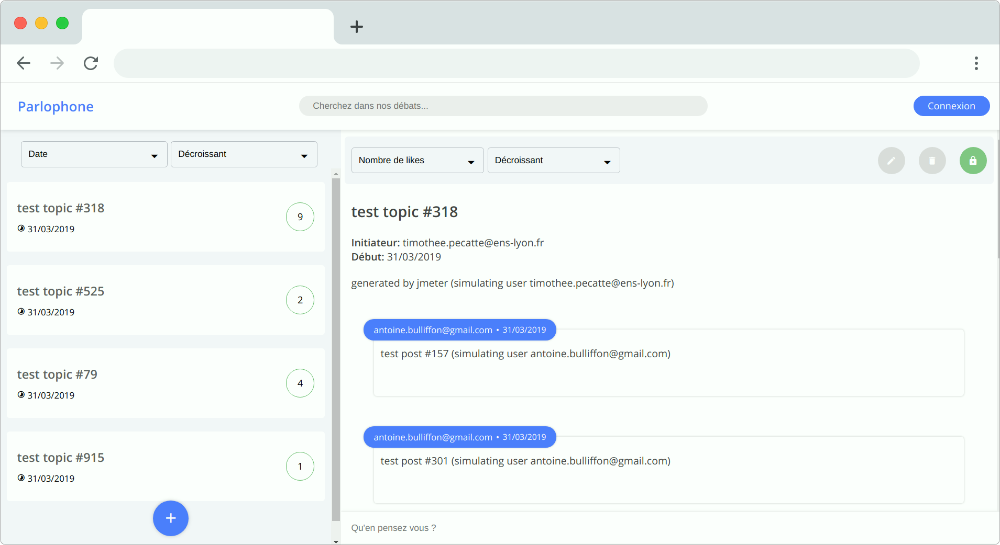

# PROJET LIFAP5
## 2018/2019

## Etudiants
- HERVE Clément *p1615530*
- TEIXEIRA MAGALHAES Tiago *p1414551*

## Description du projet

Ce projet consiste à réaliser un gestionnaire de débat, ie un forum sur lequel les gens peuvent
échanger des points de vue constructif.

Le fichier index.html contient l'application à proprement parler tandis que le fichier tests.html contient les test unitaires réalisés avec le framework Mocha.

## Test fonctionnels manuels

1/ Ajouter un sujet de débat: ok
2/ Ajouter une contribution: ok
3/ Trier les débats: ok
4/ Chercher dans les contributions: ok
5/ S'authentifier: ok
6/ Verouiller un débat: ok
7/ Supprimer un débat: ok
8/ Supprimer une contribution: ok
9/ Accéder à l'appli sur mobile: ok
10/ Liker/disliker des contributions: ok
11/ Smart refresh: ok
12/ Websockets: ok
13/ Modifier l'onglet en cas de nouveaux messages: ok

